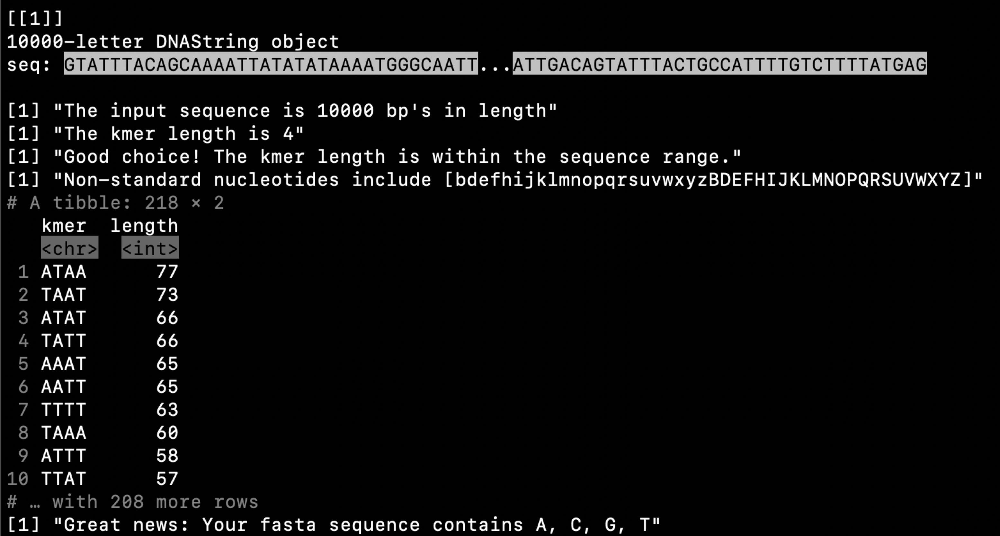

```{r setup, include=FALSE}
knitr::opts_chunk$set(echo=FALSE, message=FALSE, warning=FALSE)
```
#### This document contains a short analysis of the challenge 1 fasta files (Exp1-4) and provides instructions on how to run the `kmer_counting_tool.R` script.

```{r}
library("Biostrings")
library(tidyverse)
library(gt)
library(patchwork)
theme_set(theme_light())
```

Dear collegue, \
Thanks for sharing your concern about the kmer frequencies in your experiments. I had a chance to look at the fasta files that you sent me and, as you suspected, the kmer counts are not evenly distributed.  

## Table of Kmer counts by Experiment
```{r}
exp1 = readDNAStringSet('takehome/challenge1/experiment1.fasta')
exp2 = readDNAStringSet('takehome/challenge1/experiment2.fasta')
exp3 = readDNAStringSet('takehome/challenge1/experiment3.fasta')
exp4 = readDNAStringSet('takehome/challenge1/experiment4.fasta')
exp5 = readDNAStringSet("nonstandard_nucs.fasta")

fasta_files = list(exp1, exp2, exp3, exp4)

convert_to_df <- function(s) {
seq_name = names(s)
sequence = paste(s)
df <- tibble(seq_name, sequence)
}

fasta_df <- map_df(fasta_files, convert_to_df) 
fasta_df$seq_name = c('exp1', 'exp2', 'exp3', 'exp4')

# https://github.com/tidyverse/stringr/issues/292
str_dice <- function(s, length) { # does not return list
   L <- str_length(s)
   str_sub(s, start=seq(1L,L-length+1,length), end=seq(length,L,length))
}

count_kmers <- function(tbl) {
  tbl %>% 
    str_dice(length = 4) %>% 
    tibble() %>% 
    rename(kmer = ".") %>%
    count(kmer, sort = T, name = 'kmer_count') %>% 
    mutate(kmer = fct_reorder(kmer, kmer_count)) %>%
    mutate(standard_nucs = str_detect(kmer, "[non_stand_nucs]", negate = T))
}

exp5 <- convert_to_df(exp5)

exp_ns_nucs <- exp5$sequence %>% 
  str_dice(4) %>% tibble() %>% 
  rename(kmer = ".") 
 
```


```{r}
seq1 <- fasta_df$sequence[1] %>%
   count_kmers() %>% 
   mutate(experiment = 'Exp1_counts')
 
 seq2 <- fasta_df$sequence[2] %>%
  count_kmers() %>% 
   mutate(experiment = 'Exp2_counts')
 
 seq3 <- fasta_df$sequence[3] %>%
  count_kmers() %>% 
   mutate(experiment = 'Exp3_counts')
 
 seq4 <- fasta_df$sequence[4] %>%
  count_kmers() %>% 
   mutate(experiment = 'Exp4_counts')

sequences <- bind_rows(seq1, seq2, seq3, seq4) 

sequences %>% 
  pivot_wider(names_from = experiment, values_from = kmer_count) %>% 
  gt() %>% 
  tab_header(title = md("**Kmer counts by experiment**"),)  %>% 
  tab_options(container.height = 400,
              container.overflow.y = TRUE,
              heading.background.color = "#EFFBFC", 
              table.width = "75%", 
              column_labels.background.color = "black",
              table.font.color = "black") %>% 
  tab_style(style = list(cell_fill(color = "Grey")),
            locations = cells_body())
```
<br>

The imbalance counts per kmer is easier to observe by looking at the distributions. Notably, experiments 1 and 2 are the most skewed and experiments 3 and 4 are progressively less skewed. Do you know if there was anything different about these two experiments, particularly experiment 4?  

```{r}
p1 <- fasta_df$sequence[1] %>% 
  count_kmers() %>% 
  # mutate(kmer = fct_lump(kmer, n = 25, w = kmer_count)) %>% 
  # filter(kmer != "Other") %>% 
  ggplot(aes(kmer_count, kmer, fill = kmer_count)) +
  geom_col() +
  scale_fill_viridis_c() +
  theme(legend.position = 'none') +
  labs(title = 'Ex1 kmer counts') +
  theme(axis.title.y = element_blank(),
        axis.text.y = element_blank(),
        axis.ticks.y = element_blank())
  
p2 <- fasta_df$sequence[2] %>% 
  count_kmers() %>% 
  # mutate(kmer = fct_lump(kmer, n = 25, w = kmer_count)) %>% 
  # filter(kmer != "Other") %>% 
  ggplot(aes(kmer_count, kmer, fill = kmer_count)) +
  geom_col() +
  scale_fill_viridis_c() +
  theme(legend.position = 'none') +
  labs(title = 'Ex2 kmer counts') +
  theme(axis.title.y = element_blank(),
        axis.text.y = element_blank(),
        axis.ticks.y = element_blank())

p3 <- fasta_df$sequence[3] %>% 
  count_kmers() %>% 
  # mutate(kmer = fct_lump(kmer, n = 25, w = kmer_count)) %>% 
  # filter(kmer != "Other") %>% 
  ggplot(aes(kmer_count, kmer, fill = kmer_count)) +
  geom_col() +
  scale_fill_viridis_c() +
  theme(legend.position = 'none') +
  labs(title = 'Ex3 kmer counts') +
  theme(axis.title.y = element_blank(),
        axis.text.y = element_blank(),
        axis.ticks.y = element_blank())

p4 <- fasta_df$sequence[4] %>% 
  count_kmers() %>% 
  # mutate(kmer = fct_lump(kmer, n = 25, w = kmer_count)) %>% 
  # filter(kmer != "Other") %>% 
  ggplot(aes(kmer_count, kmer, fill = kmer_count)) +
  geom_col() +
  scale_fill_viridis_c() +
  theme(legend.position = 'none') +
  labs(title = 'Ex4 kmer counts') +
  theme(axis.title.y = element_blank(),
        axis.text.y = element_blank(),
        axis.ticks.y = element_blank())

(p1 + p2) / (p3 + p4)
```
```{r}
#create a summary table with the median, min and max
sequences %>%
  group_by(experiment) %>%
  drop_na() %>%
  summarize(`median count` = median(kmer_count),
            `mean count` = round(mean(kmer_count)),
            `min count` = min(kmer_count),
            `max count` = max(kmer_count)) %>%
  gt() %>%
  tab_header(title = md("**Kmer counts by experiment**"),)  %>%
  tab_options(container.height = 400,
              container.overflow.y = TRUE,
              heading.background.color = "#EFFBFC",
              table.width = "75%",
              column_labels.background.color = "black",
              table.font.color = "black") %>%
  tab_style(style = list(cell_fill(color = "Grey")),
            locations = cells_body())

#this table isn't very helpful
```

The density plots clearly show the distribution of kmer counts. Experiment 4 is centered around  

```{r}
sequences %>% 
  group_by(experiment) %>% 
  ggplot(aes(kmer_count, fill = experiment)) +
  geom_density() +
  facet_wrap(~experiment) +
  scale_fill_viridis_d() +
  theme(legend.position = 'none') +
  labs(title = "Density distributions of kmers(4mer) by count",
       x = "Kmer count",
       y = "Density")
```
```{r}
sequences %>% 
  mutate(kmer_count = as.numeric(kmer_count),
         counts_bins40_200 = case_when(
           kmer_count <= 20 ~ as.character('10 and under'),
           between(kmer_count, 11, 20) ~ as.character('11-20'),
           between(kmer_count, 21, 30) ~ as.character('21-30'),
           between(kmer_count, 31, 40) ~ as.character('31-40'),
           between(kmer_count, 51, 60) ~ as.character('41-50'),
           between(kmer_count, 61, 70) ~ as.character('41-50'),
           kmer_count >= 71 ~ as.character('71 and greater'),
           TRUE ~ 'other'
         )) %>% 
  filter(counts_bins40_200 == "10 and under", counts_bins40_200 != '11-20') %>% 
  group_by(counts_bins40_200) %>% 
  ggplot(aes(counts_bins40_200, fill = experiment)) +
  stat_count() +
  scale_fill_viridis_d() +
  labs(title = "Density distributions of kmers(4mer) by count",
       x = "Kmer count",
       y = "Density")


sequences %>% 
  mutate(kmer_count = as.numeric(kmer_count),
         counts_bins40_200 = case_when(
           kmer_count <= 20 ~ as.character('10 and under'),
           between(kmer_count, 11, 20) ~ as.character('11-20'),
           between(kmer_count, 21, 30) ~ as.character('21-30'),
           between(kmer_count, 31, 40) ~ as.character('31-40'),
           between(kmer_count, 51, 60) ~ as.character('41-50'),
           between(kmer_count, 61, 70) ~ as.character('41-50'),
           kmer_count >= 71 ~ as.character('71 and greater'),
           TRUE ~ 'other'
         )) %>% 
  filter(counts_bins40_200 != "10 and under", counts_bins40_200 != '11-20') %>% 
  group_by(counts_bins40_200) %>% 
  ggplot(aes(counts_bins40_200, fill = experiment)) +
  stat_count() +
  scale_fill_viridis_d() +
  labs(title = "Density distributions of kmers(4mer) by count",
       x = "Kmer count",
       y = "Density")
```

To help you check for imbalanced kmer distributions in future experiments, I designed a kmer counting analysis tool that works from the command line. The kmer counter let's you input a fasta file and kmer length, and returns a tab separated file of kmer counts ordered by frequency. The program also returns messages about the analysis including: \
* Input sequence length \
* Kmer length \
* Which nonstandard nucleotides the program can identify \
* Whether the kmer length is acceptable for the sequence range \
* Top 10 kmers by count \
* Whether the nucleotides are standard or nonstandard \

To use the tool: \
1. Clone the project from my GitHub repo (https://github.com/gmednick/kmer_analysis_tool) or simply download the directory I sent you \
2. From the command line, open the directory and change the permissions for kmer_counter_tool.R script to make it executable (chmod +x kmer_counter_tool.R) \
3. Then run the following incantation in your command line (customize input and output file names): \

e.g.,/

Rscript kmer_counter_tool.R 'input_file' kmer-length 'output_file' \
4. See the image below for expected output in the command line (Note: I am working on a mac) \



